[//]: # (## Call for Papers)

[//]: # (Our [call for papers]&#40;https://creativesumm.github.io/cfp&#41;{:target="_blank"} and [shared tasks]&#40;https://creativesumm.github.io/sharedtask&#41;{:target="_blank"} are published! )

[//]: # (## Overview)

[//]: # ()
[//]: # (Text summarization aims at condensing long documents into short paragraphs that include salient information. Given the constantly growing volume of online documents, automatic text summarization can help people to find information relevant to their interests. We envision that summarization systems of the future will need to be equipped with the ability to:)

[//]: # ()
[//]: # (- process long input sequences spanning up to hundreds of pages of text)

[//]: # (- analyze complex discourse structure such as narrative and multi-party dialog)

[//]: # (- interpret figurative language to understand and convey the salient points in the input)

[//]: # ()
[//]: # (Most research in the field has been done in the newswire and scientific domains. While important, these domains pose limited challenges for future generations of summarization due to the limited input length, literal and/or technical language, positional biases, and constrained discourse structure.)

[//]: # ()
[//]: # (An equally important, yet underexplored, domain for text summarization is creative writing, which includes documents such as books, stories, as well as scripts from plays, TV shows, and movies. Documents in this domain are uniquely characterized by their substantial length, non-trivial temporal dependencies &#40;e.g., parallel plot threads and non-linear plot development&#41;, complex structures which often combine narrative and multi-party dialogs, and a wide variety of styles. Successfully summarizing such texts requires making literary interpretations, conveying implicit information, and heavily paraphrasing the input. This makes summarizing creative documents a challenging task requiring techniques that have not yet been explored in the field.)

## Program Schedule
October 17th, 2022, Korean Standard Time (GMT+9)

**09:00–10:30 Session 1**

09:00–09:30 Invited Talk: Hierarchical 3D Adapters for Long Video-to-text Summarization, Mirella Lapata

09:30–10:00 Invited Talk: Controllable Content Creation With Planning, Shashi Narayan

10:00–10:20 IDN-Sum: A New Dataset for Interactive Digital Narrative Extractive Text Summarisation, Ashwathy T. Revi, Stuart E. Middleton and David E. Millard

**10:50–12:30 Session 2**

10:50–11:20 Invited Talk: Where did I read that? It was in a book. Challenges in Summarization of Book Chapters and Dialogues, Miguel Ballesteros

11:20–11:50 Invited Talk: Long Document Summarization using Efficient Attentions and Document Structure, Lu Wang

11:50–12:10 Invited Talk: Summarization of Long Input Texts Using Multi-Layer Neural Network, Niladri Chatterjee, Aadyant Khatri and Raksha Agarwal

12:10–12:30 LED Finteuning and Recursive Summary Generation for Automatic Summarization of Chapters from Novels, Prerna Kashyap

**13:50–15:40 Session 3**

13:50–14:20 Invited Talk: Modeling and Evaluating Faithful Generation across Modalities, Mohit Bansal

14:20–14:40 TEAM UFAL @ CreativeSumm 2022: BART and SamSum based few-shot approach for creative Summarization, Rishu Kumar and Rudolf Rosa

14:40–15:00 Long Input Dialogue Summarization with Sketch Supervision for Summarization of Primetime Television Transcripts, Nataliia Kees, Thien Nguyen, Tobias Eder and Georg Groh

15:00–15:20 AMRTVSumm: AMR-augmented Hierarchical Network for TV Transcript Summarization, Yilun Hua, Zhaoyuan Deng and Zhijie Xu

15:20–15:40 Automatic Summarization for Creative Writing: BART based Pipeline Method for Generating Summary of Movie Scripts, Aditya Upadhyay, Nidhir Bhavsar, Aakash Bhatnagar, Muskaan Singh and Petr Motlicek

**16:00–18:10 Session 4**

16:00–16:30 Invited Talk: Towards Figurative Language Generation, Xiajun Wan

16:30–17:00 Invited Talk: Discourse Aware Text Summarization, Asli Celikyilmaz

17:00–17:20 A Two-Stage Summarization Model using Scene Attributes, Eunchong Kim, Taewoo Yoo, Gunhee Cho, Suyoung Bae and Yun-Gyung Cheong

17:20–17:40 Two-Stage Movie Script Summarization: An Efficient Method For Low-Resource Long Document Summarization, Dongqi Pu, Xudong Hong, Pin-Jie Lin, Ernie Chang and Vera Demberg

17:40–18:10 Invited Talk: Summarizing Narratives with GPT-3: Measuring the next 5 years of progress, Greg Durrett

## Invited Speakers:

- Mirella Lapata, Edinburgh 
- Asli Celikyilmaz, Meta AI 
- Shashi Narayan, Google AI
- Greg Durrett, UT Austin
- Mohit Bansal, UNC
- Miguel Ballesteros, Amazon
- Lu Wang, Michigan
- Xiaojun Wan, Peking University

<!-- <a class="twitter-timeline tw-align-center" data-width="80%" margin="auto" text-align="center" href="https://twitter.com/intexsempar2020?ref_src=twsrc%5Etfw">Tweets by intexsempar2020</a>  -->

<!-- ## Program Schedule

Thursday Nov 19, 2020 Pacific Time
 
08:15–08:30 &nbsp;&nbsp;&nbsp; Opening Remarks
 
08:30–09:30 &nbsp;&nbsp;&nbsp; Invited Talk: Jacob Andreas
 
09:30–10:30 &nbsp;&nbsp;&nbsp; Invited Talk: Jonathan Berant
 
10:30–10:50 &nbsp;&nbsp;&nbsp; Break
 
10:50–11:00 &nbsp;&nbsp;&nbsp; Learning Adaptive Language Interfaces through Decomposition
 
11:00–11:10 &nbsp;&nbsp;&nbsp; Improving Sequence-to-Sequence Semantic Parser for Task Oriented Dialog
 
11:10–11:20 &nbsp;&nbsp;&nbsp; Uncertainty and Traffic-Aware Active Learning for Semantic Parsing
 
11:20–11:30 &nbsp;&nbsp;&nbsp; Did You Ask a Good Question? A Cross-Domain Question Intention Classification Benchmark for Text-to-SQL
 
11:30–12:30 &nbsp;&nbsp;&nbsp; Invited Talk: Yoav Artzi
 
12:30–13:30 &nbsp;&nbsp;&nbsp; Poster Presentation in gather.town
 
13:30–14:30 &nbsp;&nbsp;&nbsp; Invited Talk: Dilek Hakkani-Tür
 
14:30–14:40 &nbsp;&nbsp;&nbsp; QA2Explanation: Generating and Evaluating Explanations for Question Answering Systems over Knowledge Graph
 
14:40–14:50 &nbsp;&nbsp;&nbsp; ColloQL: Robust Text-to-SQL Over Search Queries
 
14:50–15:00 &nbsp;&nbsp;&nbsp; GRAPPA: Grammar-Augmented Pre-Training for Table Semantic Parsing
 
15:00–15:10 &nbsp;&nbsp;&nbsp; Beyond I.I.D.: Three Levels of Generalization for Question Answering on Knowledge Bases
 
15:10–15:20 &nbsp;&nbsp;&nbsp; Natural Language Response Generation from SQL with Generalization and Back-translation
 
15:20–15:30 &nbsp;&nbsp;&nbsp; Break
 
15:30–16:30 &nbsp;&nbsp;&nbsp; Invited Talk: Alex Polozov
 
16:30–17:30 &nbsp;&nbsp;&nbsp; Invited Talk: Richard Socher
 
17:30–17:35 &nbsp;&nbsp;&nbsp; Closing remarks
 -->
<!-- ## Invited Speakers

<table>
  <tbody>
    <tr>
      <td width="25%"><a href="https://yoavartzi.com/">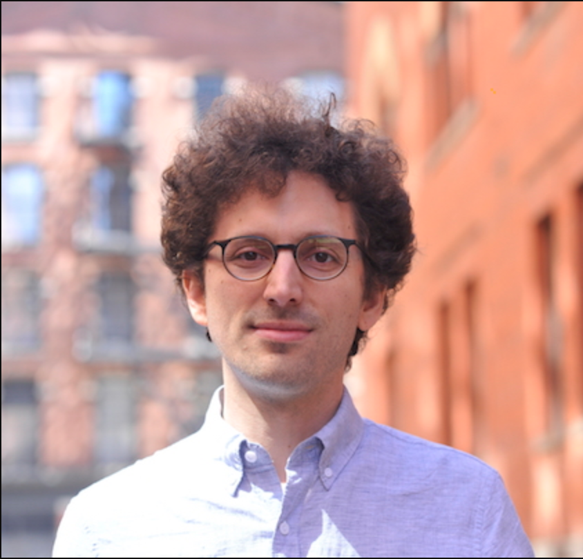</a></td>
      <td width="25%"><a href="http://www.cs.tau.ac.il/~joberant/">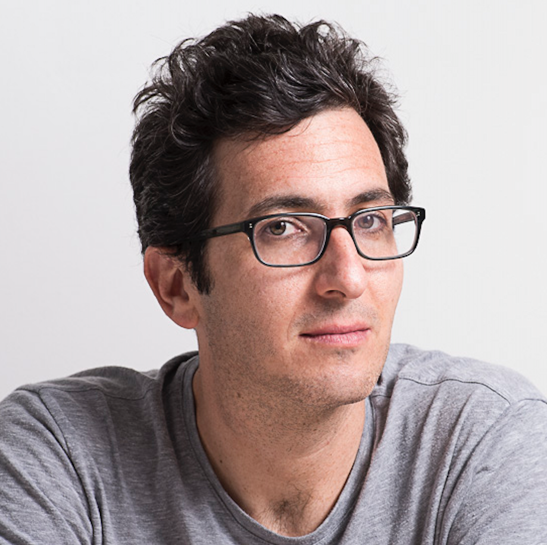</a></td>
      <td width="25%"><a href="https://www.socher.org/">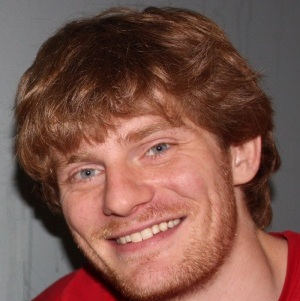</a></td>
      <td width="25%"><a href="https://scholar.google.com/citations?user=GMcL_9kAAAAJ&hl=en">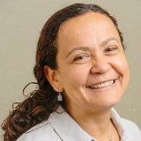</a></td>
    </tr>
    <tr>
      <td><a href="https://yoavartzi.com/">Mohit Bansal (UNC)</a></td>
      <td><a href="http://www.cs.tau.ac.il/~joberant/">Miguel Ballesteros (Amazon)</a></td>
      <td><a href="https://www.socher.org/">Asli Celikyilmaz, Facebook AI </a></td>
      <td><a href="https://scholar.google.com/citations?user=GMcL_9kAAAAJ&hl=en">Greg Durrett (UT Austin)</a></td>
    </tr>
    <tr>
      <td width="25%"><a href="https://alexpolozov.com/">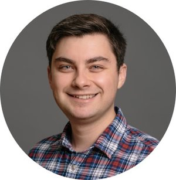</a></td>
      <td width="25%"><a href="https://www.mit.edu/~jda/">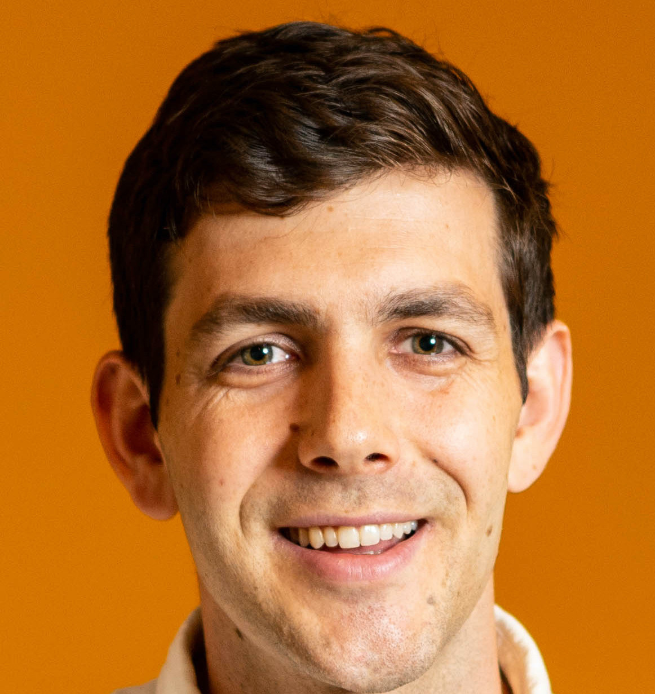</a></td>
    </tr>
    <tr>
      <td><a href="https://alexpolozov.com/">Mirella Lapata, University of Edinburgh</a></td>
      <td><a href="https://www.mit.edu/~jda/">Lu Wang, University of Michigan</a></td>
      <td><a href="https://www.mit.edu/~jda/">Xiaojun Wan, Wangxuan Institute of Computer Technology</a></td>
    </tr>
  </tbody>
</table> -->

<!-- - [Yoav Artzi](https://yoavartzi.com/), Cornell University
- [Jonathan Berant](http://www.cs.tau.ac.il/~joberant/), Tel Aviv University/Allen Institute for Artificial Intelligence
- [Richard Socher](https://www.socher.org/), Salesforce Research
- [Dilek Hakkani-T&uuml;r](https://scholar.google.com/citations?user=GMcL_9kAAAAJ&hl=en), Amazon Alexa AI
- [Alex Polozov](https://alexpolozov.com/), Microsoft Research
- [Mirella Lapata](https://homepages.inf.ed.ac.uk/mlap/), The University of Edinburgh -->

<!-- ## Steering Committee

<table>
  <tbody>
    <tr>
      <td width="25%"></td>
      <td width="25%"></td>
      <td width="25%"></td>
      <td width="25%"></td>
    </tr>
    <tr>
      <td><a href="http://www.cs.tau.ac.il/~joberant/">Jonathan Berant (Tel Aviv University/AI2)</a></td>
      <td><a href="http://www.phontron.com/">Graham Neubig (CMU)</a></td>
      <td><a href="https://researcher.watson.ibm.com/researcher/view.php?person=us-yunyaoli">Yunyao Li (IBM Research)</a></td>
      <td><a href="http://cmxiong.com/">Caiming Xiong (Salesforce Research)</a></td>
    </tr>
    <tr>
      <td width="25%"><a href="https://www.cs.yale.edu/homes/radev/">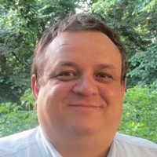</a></td>
      <td width="25%"><a href="https://www.cs.washington.edu/people/faculty/lsz">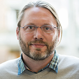</a></td>
    </tr>
    <tr>
      <td><a href="https://www.cs.yale.edu/homes/radev/">Dragomir Radev (Yale University)</a></td>
      <td><a href="https://www.cs.washington.edu/people/faculty/lsz">Luke Zettlemoyer (University of Washington)</a></td>
    </tr>
  </tbody>
</table> -->
<!-- - [Jonathan Berant](http://www.cs.tau.ac.il/~joberant/), Tel-Aviv University
- [Graham Neubig](http://www.phontron.com/), Carnegie Mellon University
- [Yunyao Li](https://researcher.watson.ibm.com/researcher/view.php?person=us-yunyaoli), IBM Research
- [Caiming Xiong](http://www.stat.ucla.edu/~caiming/), Salesforce Research
- [Dragomir Radev](https://www.cs.yale.edu/homes/radev/), Yale University
- [Luke Zettlemoyer](https://www.cs.washington.edu/people/faculty/lsz), University of Washington -->

<!-- ## Organizing Committee

<table>
  <tbody>
    <tr>
      <td width="25%"></td>
      <td width="25%"></td>
      <td width="25%">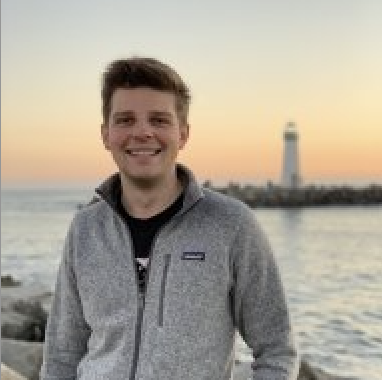</td>
      <td width="25%"></td>
    </tr>
    <tr>
      <td><a href="http://www.cs.columbia.edu/~kathy/">Kathleen Mckeown (Columbia University)</a></td>
      <td><a href="https://shirleyhan6.github.io/">Simeng Han (Yale University)</a></td>
      <td><a href="https://about.me/wkryscinski">Wojciech Kryściński (Salesforce Research)</a></td>
      <td><a href="https://www.cs.columbia.edu/~faisal/">Faisal Ladhak (Columbia University)</a></td>
    </tr>
    <tr>
      <td width="25%">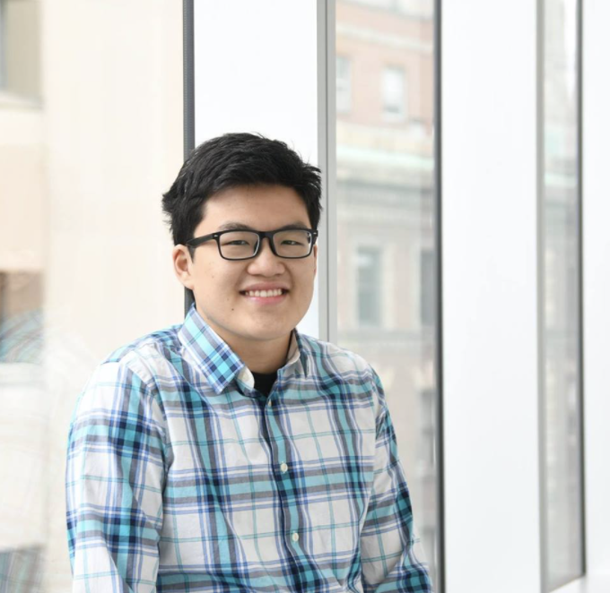</td>
      <td width="25%">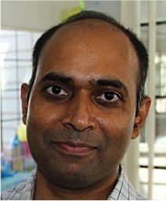</td>
      <td width="25%"></td>
      <td width="25%"></td>
    </tr>
    <tr>
      <td><a href="https://manestay.github.io/">Bryan Li (University of Pennsylvania)</a></td>
      <td><a href="https://www.amazon.science/author/ramesh-nallapati">Ramesh Nallapati (Amazon)</a></td>
      <td><a href="http://www.cs.yale.edu/homes/radev/">Dragomir Radev (Yale University)</a></td>
      <td><a href="https://swiseman.github.io/">Sam Wiseman (Duke University)</a></td>
    </tr>
  </tbody>
</table> -->

<!-- ## Sponsors

 -->

